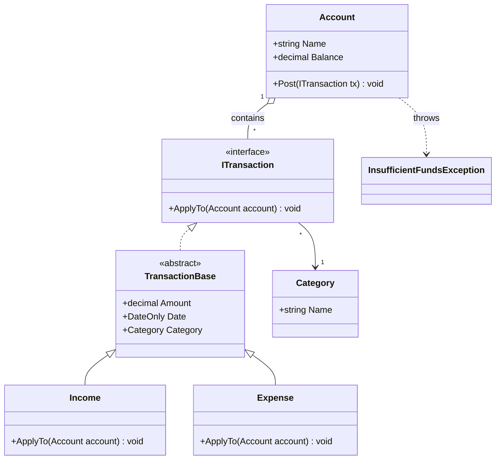

```mermaid
classDiagram
    class ITransaction {
        <<interface>>
        +ApplyTo(Account account) void
    }
    class TransactionBase {
        <<abstract>>
        +decimal Amount
        +DateOnly Date
        +Category Category
    }
    class Income {
        +ApplyTo(Account account) void
    }
    class Expense {
        +ApplyTo(Account account) void
    }
    class Account {
        +string Name
        +decimal Balance
        +Post(ITransaction tx) void
    }
    class Category {
        +string Name
    }
    class InsufficientFundsException

    ITransaction <|.. TransactionBase
    TransactionBase <|-- Income
    TransactionBase <|-- Expense
    Account "1" o-- "*" ITransaction : contains
    ITransaction "*" --> "1" Category
    Account ..> InsufficientFundsException : throws
```