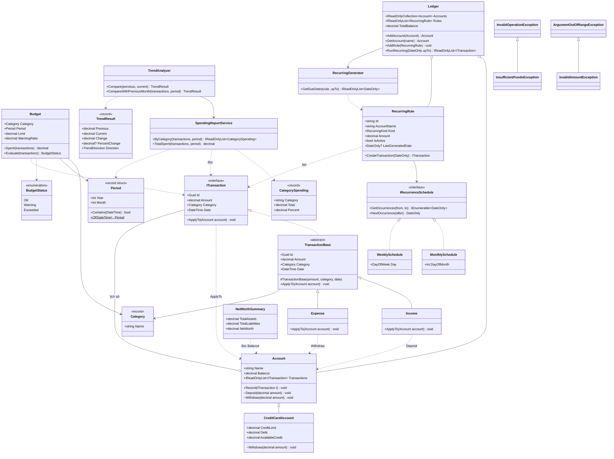

# Class Diagram v3 - Personal Finance / Budget Tracker

```mermaid
classDiagram
    direction TB

    %% ===== Giao dịch (đa hình) =====
    class ITransaction {
        <<interface>>
        +Guid Id
        +decimal Amount
        +Category Category
        +DateTime Date
        +ApplyTo(Account account) void
    }
    class TransactionBase {
        <<abstract>>
        +Guid Id
        +decimal Amount
        +Category Category
        +DateTime Date
        #TransactionBase(amount, category, date)
        +ApplyTo(Account account)* void
    }
    class Income {
        +ApplyTo(Account account) void
    }
    class Expense {
        +ApplyTo(Account account) void
    }
    ITransaction <|.. TransactionBase
    TransactionBase <|-- Income
    TransactionBase <|-- Expense

    %% ===== Tài khoản =====
    class Account {
        +string Name
        +decimal Balance
        +IReadOnlyList~ITransaction~ Transactions
        +Record(ITransaction t) void
        ~Deposit(decimal amount) void
        ~Withdraw(decimal amount) void
    }
    class CreditCardAccount {
        +decimal CreditLimit
        +decimal Debt
        +decimal AvailableCredit
        ~Withdraw(decimal amount) void
    }
    Account <|-- CreditCardAccount
    Account o-- ITransaction : lịch sử
    ITransaction ..> Account : ApplyTo
    Income ..> Account : Deposit
    Expense ..> Account : Withdraw

    class Category {
        <<record>>
        +string Name
    }
    TransactionBase --> Category

    %% ===== Ngân sách =====
    class Budget {
        +Category Category
        +Period Period
        +decimal Limit
        +decimal WarningRatio
        +Spent(transactions) decimal
        +Evaluate(transactions) BudgetStatus
    }
    class BudgetStatus {
        <<enumeration>>
        OK
        Warning
        Exceeded
    }
    class Period {
        <<record struct>>
        +int Year
        +int Month
        +Contains(DateTime) bool
        +Of(DateTime)$ Period
    }
    Budget --> Category
    Budget --> Period
    Budget ..> BudgetStatus
    Budget ..> ITransaction : đọc

    %% ===== Báo cáo (tách khỏi ghi giao dịch) =====
    class SpendingReportService {
        +ByCategory(transactions, period) IReadOnlyList~CategorySpending~
        +TotalSpent(transactions, period) decimal
    }
    class CategorySpending {
        <<record>>
        +string Category
        +decimal Total
        +decimal Percent
    }
    class TrendAnalyzer {
        +Compare(previous, current) TrendResult
        +CompareWithPreviousMonth(transactions, period) TrendResult
    }
    class TrendResult {
        <<record>>
        +decimal Previous
        +decimal Current
        +decimal Change
        +decimal? PercentChange
        +TrendDirection Direction
    }
    TrendAnalyzer --> SpendingReportService
    SpendingReportService ..> CategorySpending
    TrendAnalyzer ..> TrendResult
    SpendingReportService ..> ITransaction : đọc
    SpendingReportService ..> Period

    %% ===== Tổng hợp nhiều tài khoản =====
    class NetWorthSummary {
        +decimal TotalAssets
        +decimal TotalLiabilities
        +decimal NetWorth
    }
    NetWorthSummary ..> Account : đọc Balance

    %% ===== Giao dịch định kỳ =====
    class IRecurrenceSchedule {
        <<interface>>
        +GetOccurrences(from, to) IEnumerable~DateOnly~
        +NextOccurrence(after) DateOnly
    }
    class MonthlySchedule {
        +int DayOfMonth
    }
    class WeeklySchedule {
        +DayOfWeek Day
    }
    IRecurrenceSchedule <|.. MonthlySchedule
    IRecurrenceSchedule <|.. WeeklySchedule

    class RecurringRule {
        +string Id
        +string AccountName
        +RecurringKind Kind
        +decimal Amount
        +bool IsActive
        +DateOnly? LastGeneratedDate
        +CreateTransaction(DateOnly) ITransaction
    }
    class RecurringGenerator {
        +GetDueDates(rule, upTo) IReadOnlyList~DateOnly~
    }
    RecurringRule --> IRecurrenceSchedule
    RecurringRule ..> ITransaction : tạo
    RecurringGenerator ..> RecurringRule

    class Ledger {
        +IReadOnlyCollection~Account~ Accounts
        +IReadOnlyList~RecurringRule~ Rules
        +decimal TotalBalance
        +AddAccount(Account) Account
        +GetAccount(name) Account
        +AddRule(RecurringRule) void
        +RunRecurring(DateOnly upTo) IReadOnlyList~ITransaction~
    }
    Ledger o-- Account
    Ledger o-- RecurringRule
    Ledger --> RecurringGenerator

    %% ===== Ngoại lệ =====
    class InsufficientFundsException
    class InvalidAmountException
    InvalidOperationException <|-- InsufficientFundsException
    ArgumentOutOfRangeException <|-- InvalidAmountException
```
